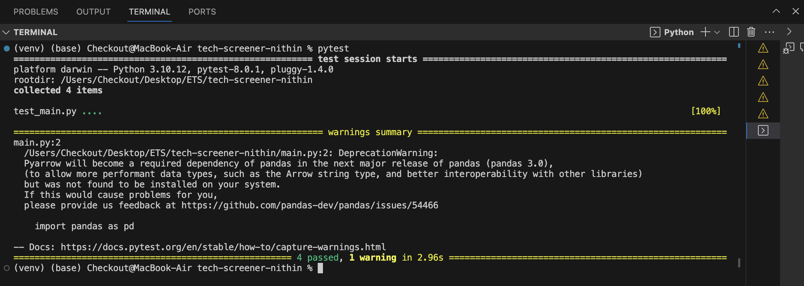
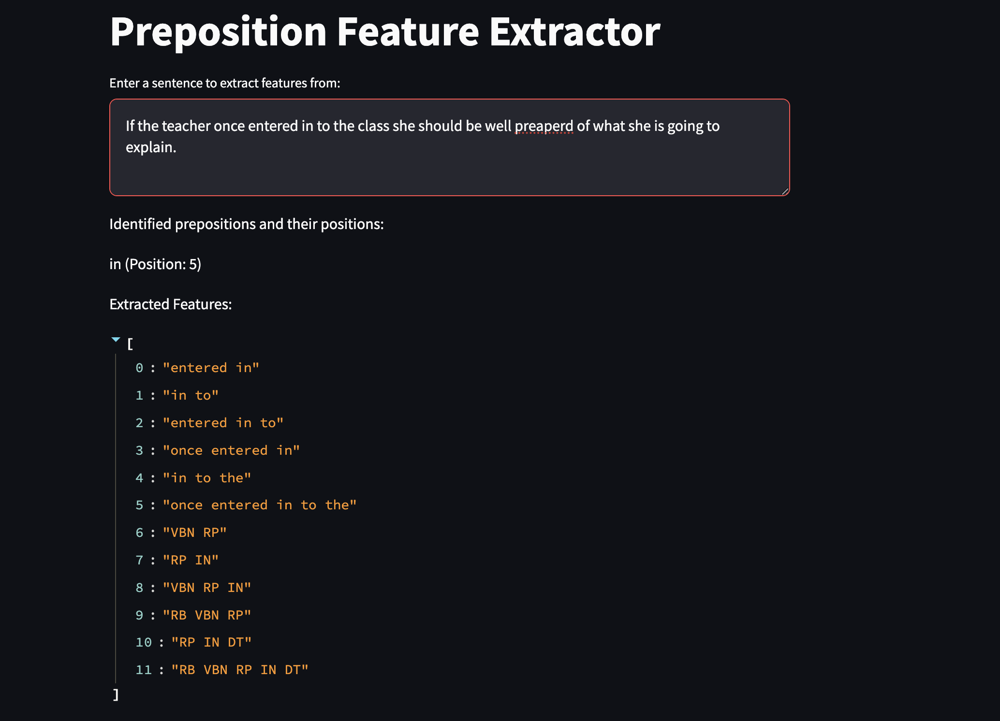

# Feature Extraction for Grammatical Error Correction

## Overview

This Python project focuses on extracting linguistic features surrounding prepositions within sentences, crucial for training supervised grammatical error correction models.It demonstrates the application of NLP techniques to enhance grammatical error correction systems.

## Prerequisites

- Python 3.8 or newer ( 3.10.12 Recommended )
- Pandas
- SpaCy

## Installation

1. **Clone the repository:**
    ``` Not Required    
    ```

2. **Set up a virtual environment (optional but recommended):**
    ```bash
    python -m venv venv
    source venv/bin/activate  # On Windows, use `venv\Scripts\activate`
    ```

3. **Install the required libraries:**
    ```bash
    pip install -r requirements.txt
    ```

## Task Description

The core task involves processing sentences to identify occurrences of specified prepositions (on, for, of, to, at, in, with, by) and extracting relevant features from the surrounding context. These features has both tokens and part-of-speech tags in sequences surrounding each identified preposition.

## Usage

1. **Prepare Input Data:** Place your `sentences.csv` in the project's root directory, formatted with `Id` and `Sentence` columns.

2. **Run the Feature Extraction Script:**
    ```bash
    python main.py
    ```
   This command processes each sentence from the input, identifies valid prepositions, extracts surrounding features, and saves the results in a JSONLines file named `output.jsonl`.

## Output Format

The output, a `.jsonl` file, contains lines where each represents a set of features extracted from around a preposition in the input sentences. Each line is structured as a JSON object:
```sample json feature

{"id": "1_6", "prep": "to", "features": ["in to", "to the", "in to the", "entered in to", "to the class", "entered in to the class", "RP IN", "IN DT", "RP IN DT", "VBN RP IN", "IN DT NN", "VBN RP IN DT NN"]}

```
## Testing

This project includes unit test & functional tests to verify the feature extraction process's accuracy and reliability comprehensively. To run the tests, execute the following command:
```bash

pytest
```
These tests cover various scenarios, ensuring that the application functions correctly under different conditions and the output meets the expected format and content specifications.

Sample Test Results:


## Assumptions & Design Choices
1. Penn Treebank POS tags is not Hard requirement ( NLTK is not used ) as spacy is sufficient for the task.
2. The feature extraction process is designed to be case-insensitive, as the prepositions are not case-sensitive.
3. special characters are not considered as part of the feature extraction process.
4. POS tagging algorithms are generally fast and optimized for sentence-level processing so instead of doing it for specific prepositions, the entire sentence is tagged and then the prepositions are extracted from the tagged sentence.
5. Prepositions are saved in a file and can be easily modified to include more prepositions and to avoid hardcoding.

## Frontend Interface with Streamlit
To provide an interactive way to utilize the feature extraction capabilities, a frontend interface has been developed using Streamlit. This interface allows users to input sentences and visually see the identified prepositions along with the extracted features.

Run the Streamlit app:

```bash
streamlit run frontend.py
```
This will start a local web server, and your default web browser will automatically open to display the Streamlit application. Here, you can input sentences and interactively explore the features extracted from around the identified prepositions.

# sample output

